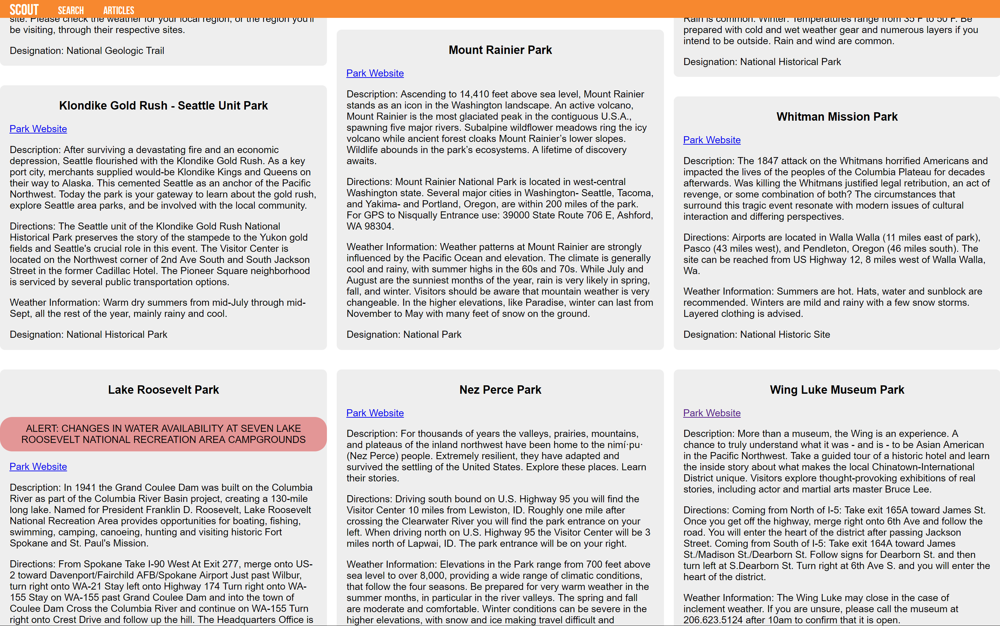

# Capital One Software Engineering Summit Project
Conner Wallace
University of Washington 2022
_________________________________________________

## About the Project
Scout is a tool designed to help with finding information about national parks near you. Simply enter your state and choose a category that interests you. Once this is done you will be greeted by several pins on the map for you to explore. Clicking on one and clicking on the name will show you more details about that place. 

If you want to read articles about all the incredible parks the US has to offer, simply click on the articles link on the top left. Here you can see each articles name, photo, and description. If one interests you, click on the card to read more! 
Available here: connermwallace.github.io
_________________________________________________
## Screenshots
### Home

### Search

### Articles

_________________________________________________
## Feature Overview
### Required Features
#### Search
* Enter a state's two letter code and search all the various locations that state has to offer. 
* Search by: campgrounds, parks, places, or visitor centers.
#### Details about locations
* Clicking on the title for a pin on the map will take you directly to a description of that park. 
#### Articles
* Clicking the articles link at the top, or scrolling down, you will be able to read as many articles as the NPS API has to offer.
* Find an article that interests you? Simply click on the article's card and you'll be taken to the article's website to read more.
#### Alerts
* Using all the alerts available on the NPS API, if a park has a current alert in affect, its description will have a large red alert displaying the alert.
### Extra Features
#### Map 
* Want to find areas close to where you are? All you have to do is enter your state and Scout will automatically show you all the locations in your state that match your search. 
* Created using leaflet, an open source javascript library
_________________________________________________
## API/Tech used
### National Park Services API
[https://www.nps.gov/subjects/developer/api-documentation.htm](https://www.nps.gov/subjects/developer/api-documentation.htm)
### Leaflet JS
[https://leafletjs.com/](https://leafletjs.com/)
_________________________________________________

## Obstacles
* NPS API contained broken image links, and listed the lat long data in different formats
* NPS API used different names for the name of a place. Sometimes it was "name", other times it was "title".
